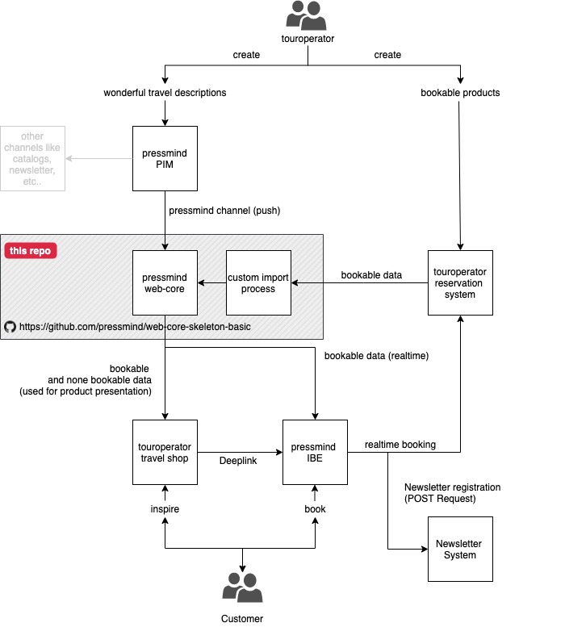

# pressmind® web-core

This is a simple skeleton web application using the pressmind SDK. It is intended to give you a clean starting point for creating web applications or RESTFULL Services using the pressmind® PIM-System

## System overview

## Quickstart

This quickstart is aimed towards an experienced audience.  
You should have at least an intermediate knowledge in MySQL, PHP-Programming and webserver-administration to get the application running as intended.

### Installation
* [System requirements](quickstart/system_requirements.md)
* [Installation](quickstart/installation.md)
* [Understanding pressmind anatomy](quickstart/wtf_pressmind.md)

### Configuratinon
* [Configuration options](quickstart/config.md)
* [Pretty URL](quickstart/pretty_url.md)
* [Image handling](quickstart/image_handling.md)

### Administration
* [CLI Tools](quickstart/cli_tools.md)
  
### Data Management
* [Custom Import Hooks](quickstart/custom_import_hooks.md)
* [Writing Export Scripts](quickstart/writing_export_scripts.md)

### REST Server
* [Initializing the rest server](quickstart/rest_server_initialize.md)

### Search and Display Media Object
* [Searching and list media objects](quickstart/search.md)
* [Building Search Filters](quickstart/search_filter.md)
* [Custom SQL Queries](quickstart/custom_sql_queries.md)
* [Building Itineraries](quickstart/itinerary.md)

## More 
See this [TravelShop Theme](https://github.com/pressmind/wp-travelshop-theme) 
for a working WordPress implementation of this pressmind SDK sample application.