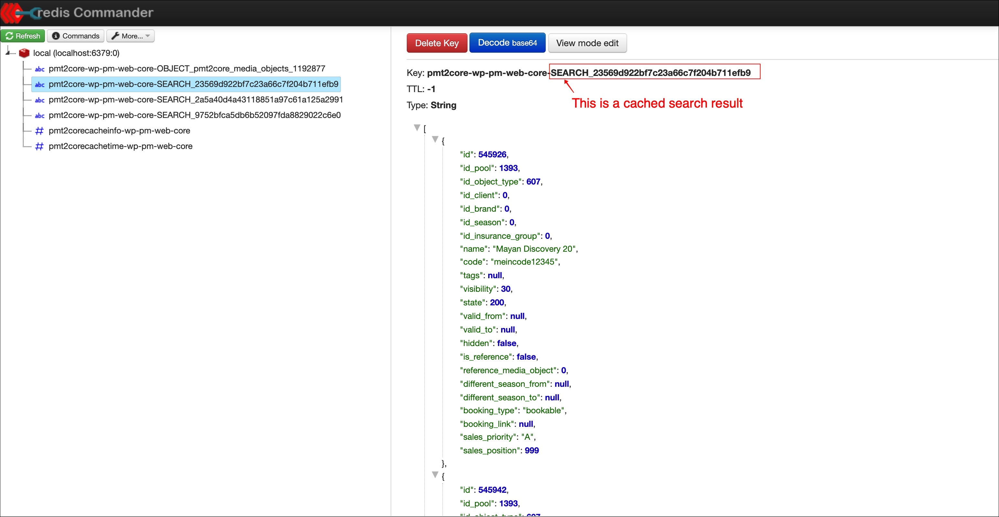

# Caching 
It's possible to use different redis based caching layer. 

## Caching layers

### Object cache
The object cache stores the whole pressmind based media object. 

### Search cache
Based on a search query, the resultset will be cached.

### Rest cache
Based on a rest request, the resultset will be cached.

## Strategy
Each cache key is enabled to refresh itself in the background after a defined range of time.
To avoid a cache blowup, the keys have a defined lifetime which depends on the idletime of each key.

# Setup

## 1. Enable caching in the config
Go to the settings section and enable the cache. 
Check all parameters and configure your environment.
````json
"cache" => [
            "enabled" => true,
            "adapter" => [
                "name" => "Redis",
                "config" => [
                    "host" => "127.0.0.1",
                    "port" => 6379,
                    "connection_string" => NULL,
                ],
            ],
            "key_prefix" => "DATABASE_NAME",
            "disable_parameter" => [ // currently used only for the rest api
                "key" => "no_cache",
                "value" => 1,
            ],
            "update_parameter" => [ // currently used only for the rest api
                "key" => "update_cache",
                "value" => 1,
            ],
            "types" => [ // enable desired cache types
                "REST",
                "SEARCH",
                "OBJECT",
            ],
            "update_frequency" => 3600, // key will be refreshed after this value
            "max_idle_time" => 86400, // key will be deleted after this idle time is reached
        ],
````

## 2. Check if the cron job is running and configured correctly
The cache needs the worker process to refresh the keys and keep it clean. 
So please check that ```cron.php``` is configured as cron (see [installation](installation.md#3-configure-crontab)).
Also check the ```config.json``` and ensure that the ```scheduled_tasks```
contains the ```Cache Clean Up```-Task

````json
"scheduled_tasks" => [
         [
            "name" => "Cache Clean Up",
            "class_name" => "\\Pressmind\\Cache\\Service",
            "schedule" => [
                "type" => "Minutely",
                "time" => "Period",
                "value" => "5",
            ],
            "methods" => [
                [
                    "method" => "cleanUp",
                    "parameters" => NULL,
                    "position" => 1,
                ],
            ],
        ],
    ],
],
````

## 3. Check if its working
Click trough your application/page and check if the redis database is growing.

Use ```redis-cli``` as command line client for connecting to the redis server. 

if everthing works fine, your redis database must looking, something like this:
````shell
peter@macbook ~ % redis-cli
127.0.0.1:6379> keys *
1) "pmt2corecachetime-wp-pm-web-core"
2) "pmt2core-wp-pm-web-core-OBJECT_pmt2core_media_objects_1192877"
3) "pmt2corecacheinfo-wp-pm-web-core"
4) "pmt2core-wp-pm-web-core-SEARCH_23569d922bf7c23a66c7f204b711efb9"
5) "pmt2core-wp-pm-web-core-SEARCH_2a5a40d4a43118851a97c61a125a2991"
6) "pmt2core-wp-pm-web-core-SEARCH_9752bfca5db6b52097fda8829022c6e0"
````

# Redis keys explained
To understand the whole process its required to take a look in the different redis keys

Key: ```pmt2corecacheinfo-wp-pm-web-core ```<br>
This key stores a list of all queries that have a saved a result set in the redis cache. 
The cron worker will use this list to rebuild cache keys.


Key: ```pmt2corecachetime-wp-pm-web-core```<br>
This key stores a list of the created date of each key. 
The cron worker will use this list to keep the cache db clean.


Key: ```pmt2core-wp-pm-web-core-OBJECT_pmt2core_media_objects_*```<br>
This key stores the pressmind media object.

It will be updated trough this events:
* cache is enabled and the key is missing
* key exists, but the key is outdated (defined through: ```update_frequency```) 
* key is missing or key exists and the media object will be updated trough the importer


Key: ```pmt2core-wp-pm-web-core-SEARCH_*```<br>
This key stores the resultset of a search query

It will be updated trough this events:
* cache is enabled and the key is missing
* key exists, but the key is outdated (defined through: ```update_frequency```)



# FAQ
## 1. How can I flush the cache?
Use the ```FLUSHALL``` command, see example:
```shell
peter@macbook ~ % redis-cli
127.0.0.1:6379> FLUSHALL
OK
```
Be aware to do this during you have a high traffic load on your application.

## 2. How can I delete a defined key?
````shell
peter@macbook ~ % redis-cli
127.0.0.1:6379> del key pmt2core-wp-pm-web-core-OBJECT_pmt2core_media_objects_1192877
(integer) 1
````

## 3. Is there a nice gui for the redis client?
Try [redis-commander ](https://www.npmjs.com/package/redis-commander)